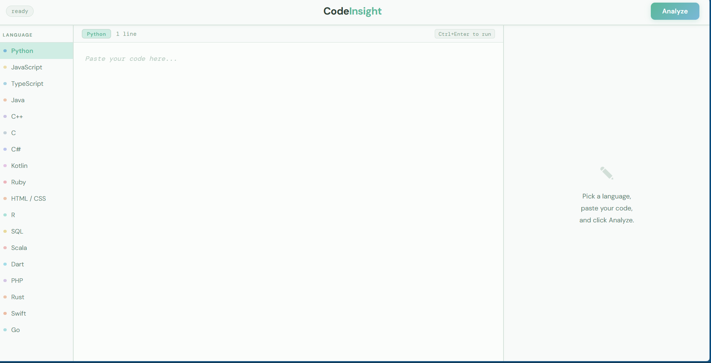
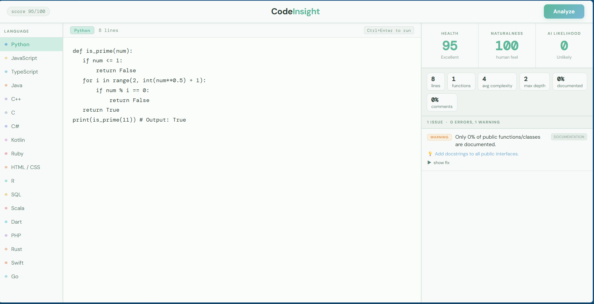

<div align="center">


# CodeInsight – Multi-Language Static Code Analyzer

Production-grade static analysis platform that evaluates code quality, detects security flaws, measures code naturalness, and estimates AI-generated likelihood across **18 programming languages**.

Built with **Python + Flask**, using **AST-based parsing for Python** and **heuristic-driven analysis pipelines** for all other supported languages.


</div>

---


## Features

* **Code Quality Scoring** — Weighted 0–100 maintainability score based on severity analysis
* **AI Likelihood Detection** — Estimates probability of AI-generated or template-heavy code
* **Naturalness Analysis** — Evaluates how human-written code feels structurally
* **Security Scanning** — Detects unsafe patterns, hardcoded secrets, and risky constructs
* **Cyclomatic Complexity Analysis** — Flags deeply nested or overly complex logic
* **Language-Specific Smell Detection** — Detects anti-patterns unique to each language
* **Issue Fix Suggestions** — Provides explanations and corrected code examples
* **Multi-Language Support** — Supports 18 programming languages
* **Real-Time Metrics Dashboard** — Displays complexity, nesting, coverage, and structure metrics
* **Lightweight Architecture** — No heavyweight parser dependencies required

---

## Screenshots

### Homepage



### Analysis Result



---

## Tech Stack

| Layer           | Technology                        |
| --------------- | --------------------------------- |
| Backend         | Python 3                          |
| Framework       | Flask                             |
| Analysis Engine | Python AST + Regex Heuristics     |
| Frontend        | HTML5, CSS3, Vanilla JavaScript   |
| Parsing         | Python `ast` module               |
| Security Checks | Custom pattern matching           |
| Metrics Engine  | Complexity + structural analyzers |
| Architecture    | Monolithic lightweight analyzer   |
| Deployment      | Local / Flask server              |

---

## Project Structure

```bash
CodeInsight/
├── app.py                       # Flask server + routing
├── analyzer.py                  # Core static analysis engine
├── templates/
│   └── index.html               # Frontend UI
├── screenshots/
│   ├── homepage.png
│   └── result.png
├── requirements.txt
└── README.md
```

---

## Supported Languages

* Python
* JavaScript / TypeScript
* Java
* C / C++
* C#
* Go
* Rust
* Swift
* Kotlin
* Ruby
* PHP
* Dart
* Scala
* SQL
* R
* HTML
* CSS

Includes detection for:

* Security vulnerabilities
* Complexity smells
* Documentation gaps
* Unsafe memory handling
* Naming inconsistencies
* Style violations
* Structural anti-patterns
* Dead / redundant logic

---

## How It Works

```text
Code Input
   ↓
Language Dispatcher
   ↓
Static Analysis + Security Scan + AI Heuristics
   ↓
AnalysisResult JSON
   ↓
Frontend Rendering + Metrics Dashboard
```

---

## Scoring System

### Code Quality Score (0–100)

Each submission receives a weighted maintainability score:

* Errors → −15 points
* Warnings → −5 points
* Informational Issues → −1 point

Analyzed categories include:

* Security flaws
* Complexity spikes
* Unsafe constructs
* Missing documentation
* Style inconsistencies

---

## Naturalness Score

Measures how closely the code resembles organically written human code by analyzing:

* Variable naming quality
* Structural consistency
* Blank-line organization
* Function symmetry
* Naming diversity
* Single-letter variable overuse

---

## AI Likelihood Detection

Flags patterns commonly associated with AI-generated or copied code:

* Placeholder-heavy identifiers
* Boilerplate comments
* Uniform line structures
* Excessively symmetrical functions
* Mixed naming conventions
* Template repetition patterns

---

## Metrics Dashboard

Tracks:

* Total lines
* Code vs blank lines
* Function count
* Cyclomatic complexity
* Maximum nesting depth
* Comment/docstring coverage

---

## Getting Started

### Prerequisites

* Python 3.9+
* pip

### Installation

```bash
# 1. Clone the repository
git clone https://github.com/YOUR_USERNAME/CodeInsight.git

# 2. Enter the project directory
cd CodeInsight

# 3. Create virtual environment
python -m venv venv

# Linux / macOS
source venv/bin/activate

# Windows
venv\Scripts\activate

# 4. Install dependencies
pip install -r requirements.txt

# 5. Run the application
python app.py
```

Open:

```bash
http://127.0.0.1:5000
```

---

## API Reference

### `POST /analyze`

Analyze source code.

### Request

```json
{
  "code": "def foo(): return 1",
  "language": "python"
}
```

### Response

```json
{
  "score": 82,
  "naturalness_score": 74,
  "ai_likelihood_score": 30
}
```

---

## Technical Notes

### AST-Based Python Analysis

Python code is parsed using the standard library `ast` module for true syntax-tree inspection rather than regex-only analysis.

### Heuristic Language Engine

Non-Python languages use pattern-based static analysis pipelines optimized for lightweight execution without requiring full compiler infrastructures.

### Security Detection

The analyzer scans for:

* Hardcoded credentials
* Unsafe evaluation patterns
* Injection-prone constructs
* Suspicious shell execution
* Weak validation logic

### Future Upgrade Path

Planned migration **Tree-sitter multi-language AST parsing** for deeper semantic analysis across all supported languages.

---

## Roadmap

* [ ] Tree-sitter integration
* [ ] Git churn analysis
* [ ] Historical trend comparison
* [ ] CLI mode
* [ ] CI/CD integration
* [ ] VS Code extension
* [ ] GitHub Action support
* [ ] Exportable PDF reports

---

## Contributing

Pull requests are welcome.

To add support for a new language:

```python
_analyze_<language>(code, lines)
```

Register the analyzer inside the dispatcher pipeline.

---

## License

MIT © Manya Singh
